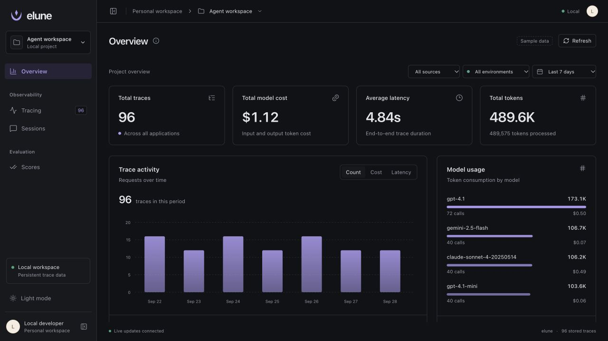
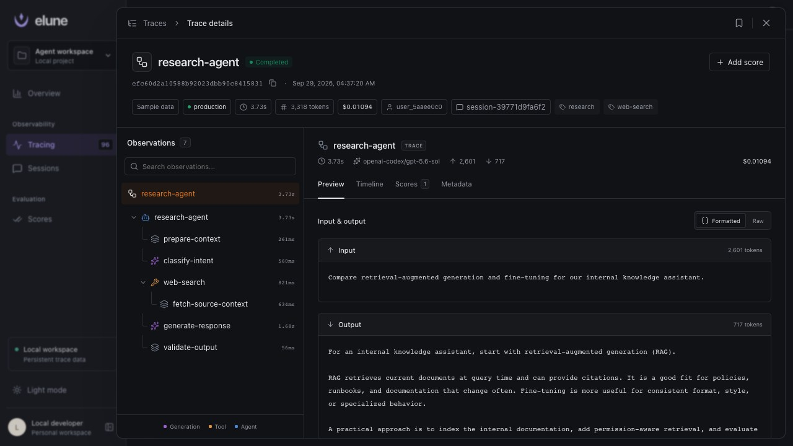
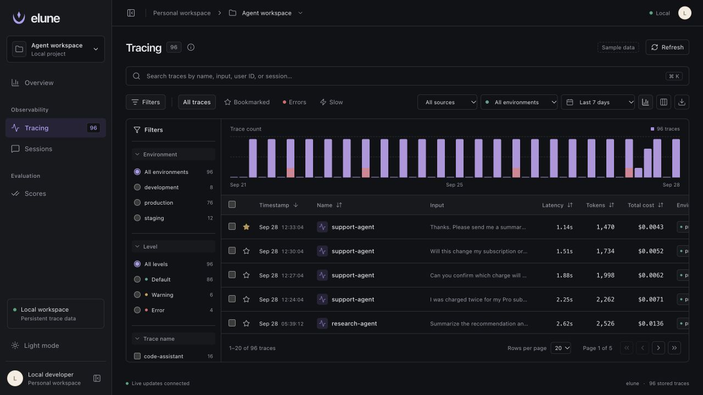
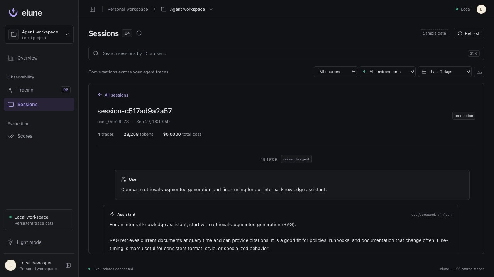

# elune

Inspect AI agent traces, model costs, tool calls, sessions, and scores on your computer. Built with Vue 3, Vite, and Go.

<table>
  <tr>
    <td width="50%"><strong>Overview</strong><br><a href="docs/screenshots/overview.jpg"></a></td>
    <td width="50%"><strong>Trace details</strong><br><a href="docs/screenshots/trace-detail.jpg"></a></td>
  </tr>
  <tr>
    <td width="50%"><strong>Traces</strong><br><a href="docs/screenshots/traces.jpg"></a></td>
    <td width="50%"><strong>Sessions</strong><br><a href="docs/screenshots/sessions.jpg"></a></td>
  </tr>
</table>

Sample data only. Select an image to open it at full size. [View scores](docs/screenshots/scores.jpg).

## Start the app

Requirements: Go 1.25 or later, Node.js 22.19 or later, npm, and Make.

From the repository root, run:

```sh
make run
```

Open [elune](http://127.0.0.1:8080).

The first start creates 96 sample traces. With `make run`, the app saves data in `backend/data/store.json`.

For frontend development, keep the backend running. In a second terminal, run `npm --prefix frontend run dev`. Open `http://127.0.0.1:5173`.

## Keep data private

- Keep elune and `PI_TRACE_URL` local. The server has no user authentication or built-in encryption. Do not expose it through a public proxy or tunnel.
- Traces can contain prompts, tool results, file paths, and secrets. The extension does not remove secrets. Review exports and screenshots before sharing them.
- Keep data and queues private. Git ignores `backend/data/` and `work/`. Exclude custom storage paths and exports from version control.
- Pi sends model requests to your selected provider. The extension sends traces to `PI_TRACE_URL`.

## Connect Pi

Use an installed Pi coding agent with access to a model. The integration checks used Pi 0.81.0.

With elune running, start Pi from the repository root in another terminal:

```sh
pi -e ./integrations/pi
```

Send a request in Pi. Select **Live Pi** in elune to inspect the trace.

To enable the package for future Pi sessions, run `pi install ./integrations/pi` from the repository root. This changes your Pi user settings.

The extension captures retries, canceled runs, and context compaction. It saves pending traces locally and retries delivery if elune is unavailable.

## Configuration

Set these environment variables before you start the related process.

| Process | Variable | Default |
| --- | --- | --- |
| Backend | `PORT` | `8080` |
| Backend | `DATA_PATH` | `data/store.json` |
| Backend | `FRONTEND_DIST` | `../frontend/dist` |
| Pi | `PI_TRACE_URL` | `http://127.0.0.1:8080` |
| Pi | `PI_TRACE_ENVIRONMENT` | `local` |
| Pi | `PI_TRACE_QUEUE_DIR` | `.elune-queue` inside the Pi session directory |

Backend paths are relative to its working directory. `make run` starts the backend from `backend/`.

## Run checks

Run these commands from the repository root:

```sh
npm --prefix frontend test
npm --prefix integrations/pi test
(cd backend && go test -race ./... && go vet ./...)
make build
```

The real Pi integration check needs a running backend and valid model access. It makes real model requests and can incur charges.

```sh
npm --prefix integrations/pi run test:integration
```

The default test model is `openai-codex/gpt-6-sol`. Set `PI_TEST_MODEL` to use another available model.

The check saves fixtures, Pi sessions, and trace queues in `work/pi-integration/`. It also adds test traces to the configured backend.
